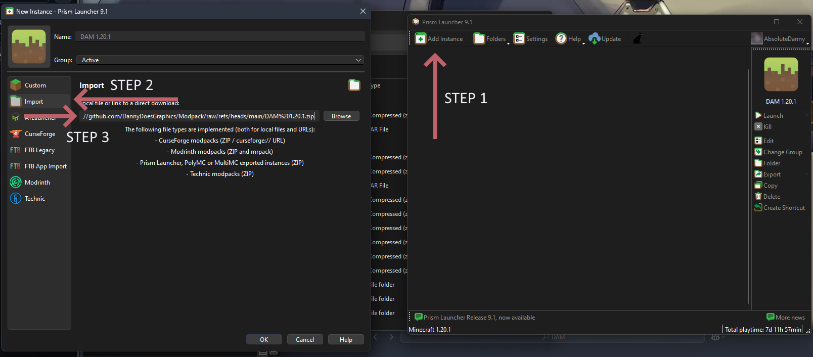

# Installing the modpack:

## The correct link:
| Modpack edition | Link | | Description |
|---|---|---|
| `DAM 1.20.1` | `https://github.com/DannyDoesGraphics/Modpack/raw/refs/heads/main/DAM%201.20.1.zip` | 1.20.1 modded edition |
| `vanilla 1_21_x` | https://raw.githubusercontent.com/DannyDoesGraphics/Modpack/refs/heads/main/vanilla_server_1_21_x/pack.toml | Latest for the vanilla server |
