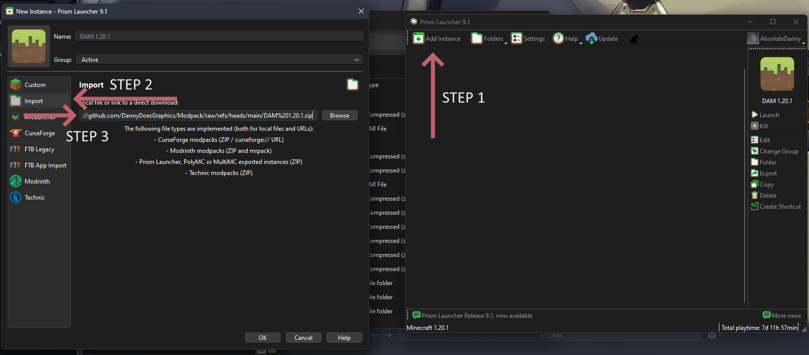

# Installing the modpack:

## The correct link:

| Modpack edition | Link                                                                                   | Description           |
| --------------- | -------------------------------------------------------------------------------------- | --------------------- |
| `DAM 1.20.1`    | `https://github.com/DannyDoesGraphics/Modpack/raw/refs/heads/main/DAM%201.20.1.zip`    | 1.20.1 modded edition |
| `sunlit`        | `https://github.com/DannyDoesGraphics/Modpack/raw/refs/heads/main/Sunlit%20Valley.zip` |

# Trouble shooting steps
Please read carefully!

## "One or more errors were encountered while installing the modpack!"
Some modpacks are too big, and the installer may have timed out simply stalling for too long.

1. "Cancel launch"
2. Open modpack again
3. Repeat 1 until you are able to successfully launch into the game

To do a sanity check, your list of mods that couldn't be installed is shrinking with each successive reboot.